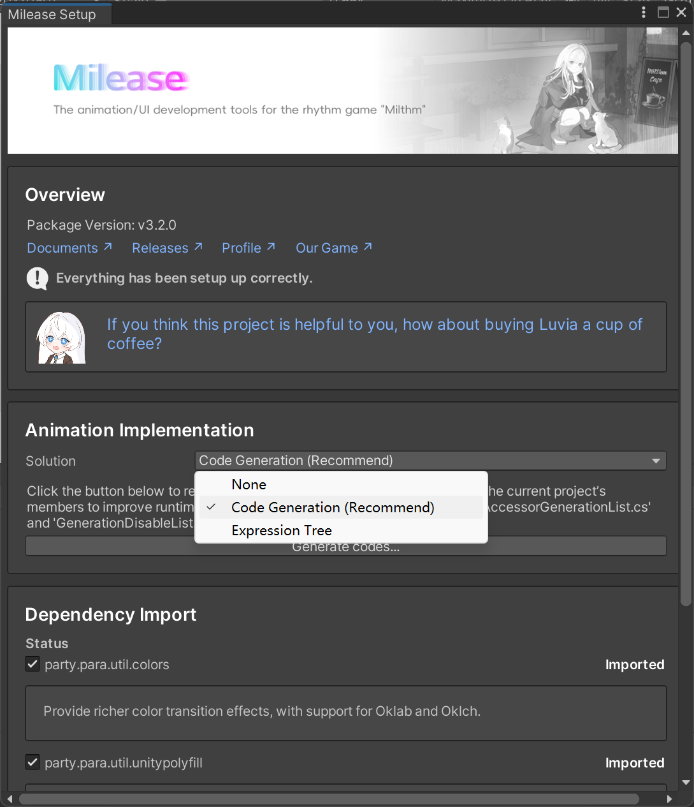

# Overview

:::warning

The English document is translated by ChatGPT.

:::

Milease is compatible with `Unity 6000`, `Unity 2022`, `Unity 2021`, and `Unity 2020`.

Versions `Unity 2019` and earlier are **not supported**.

This article provides a brief overview of compatibility, import steps, and the basic working principles.

## Import Steps

Add the following entries to your Unity project's `Packages/manifest.json`:

```json title="manifest.json"
"com.morizero.milease": "https://github.com/MorizeroDev/Milease.git",
"party.para.util.colors": "https://github.com/ParaParty/ParaPartyUtil.git?path=Colors",
```

If your project uses Unity version ≤ Unity 2021, or does not use `.NET Standard 2.1`, you will also need to import the `PolyFill` module:

```json title="manifest.json"
"party.para.util.unitypolyfill": "https://github.com/ParaParty/ParaPartyUtil.git?path=UnityPolyfill",
```

## Configure Milease

In the Unity menu bar, click “Milease -> Configuration...” and select the animation computation method:



We recommend the “Code Generation” method for best compatibility.

## Basic Principles

Milease supports two animation computation methods:

| Scripting Backend \ Method | Code Generation   | Expression Tree |
| -------------------------- | ----------------- | --------------- |
| Mono                       | ✅ Fully Supported | ✅ Supported     |
| IL2CPP                     | ✅ Fully Supported | 🚫 Not Supported |

For the code generation method, Milease generates computation code for types that can be animated, as well as accessor code for common members containing those types. These generated files are placed in the `Milease.CodeGen` assembly. You can configure which member accessors to generate and which types to exclude by modifying `AccessorGenerationList` and `GenerationDisableList.cs` in that assembly. If no pre-generated code is available for a given member or type, reflection will be used as a fallback. For the expression tree method, Milease constructs computation expressions dynamically upon first use and compiles them at runtime.

When you call a Milease animation function, it generates an animation machine instance and builds an animation controller instance by resolving the member being animated from the provided `MemberExpression`. When you play the animation for the first time, a global singleton animation manager is initialized. This includes registering scene unload events and automatically removing animation machines that are only valid in the current scene.

The animation manager updates all active animation machines on every frame. There are two types of managers: the general animation manager and the state animation manager. The state animation manager has an `Update` order of `-2`, meaning it updates earlier than most scripts unless explicitly configured otherwise.

## Notes

:::warning

* For the code generation method, if a member is not included in `AccessorGenerationList`, reflection will be used instead. This can significantly degrade performance in high-frequency scenarios. In such cases, it's recommended to move the type to a `Common` assembly, add it to `AccessorGenerationList`, and regenerate the code (via the “Generate source code” option in the Milease menu).

* For the expression tree method, dynamic compilation may take time. It is advisable to perform this ahead of time. You can use “**Milease -> Generate Milease warming up script**” to generate pre-warm code and compile commonly used expressions during the loading phase for smoother runtime performance.

* During animation machine construction, reflection is used and may lead to `GC.Alloc`, which can be a performance bottleneck. For large and static animations, consider constructing them during the loading phase and reusing them. For simpler cases, the overhead is generally acceptable.

* While animation computation is lightweight, updating `Transform` or related components might become a performance bottleneck and require additional optimization.

* For the code generation method, you may encounter circular dependency issues: your code assembly must reference Milease to use animation operations, and Milease must reference `Milease.CodeGen` to access the generated code. If your custom types/members are in the same assembly, Unity will not support this circular dependency. To resolve this, move them to a `Common` assembly and use proxy classes.

:::
